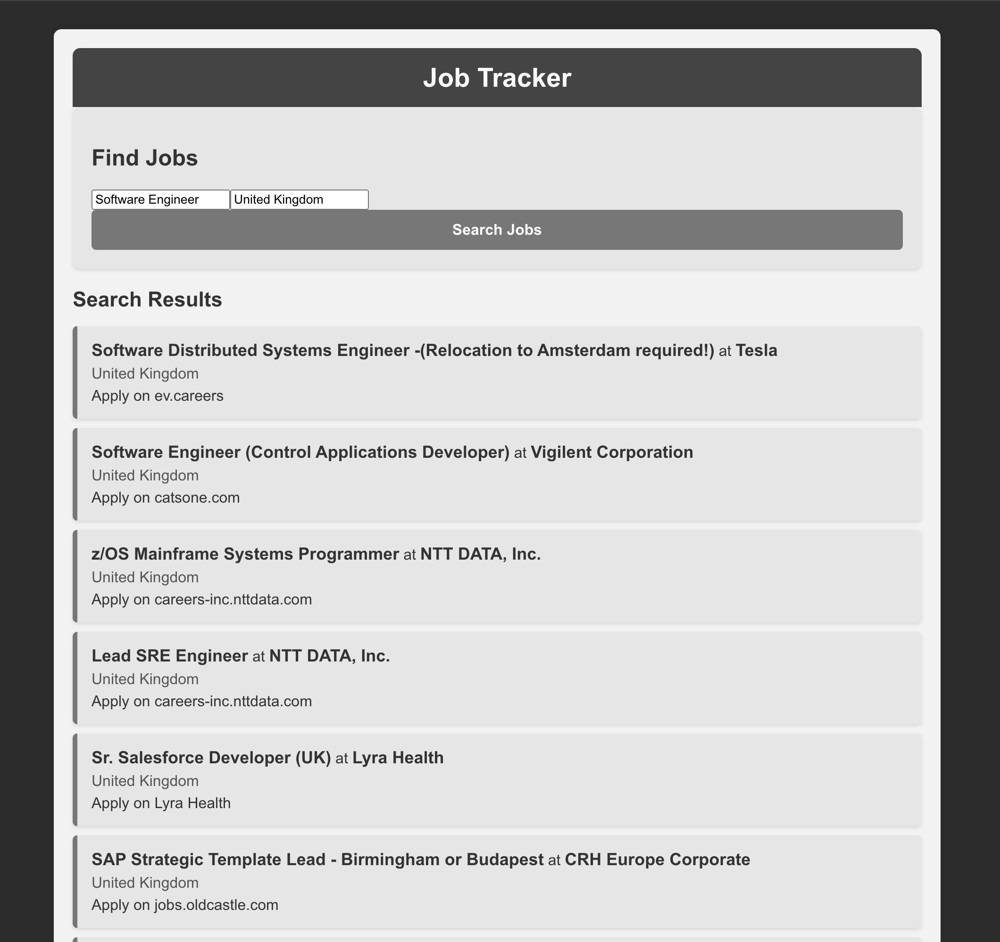
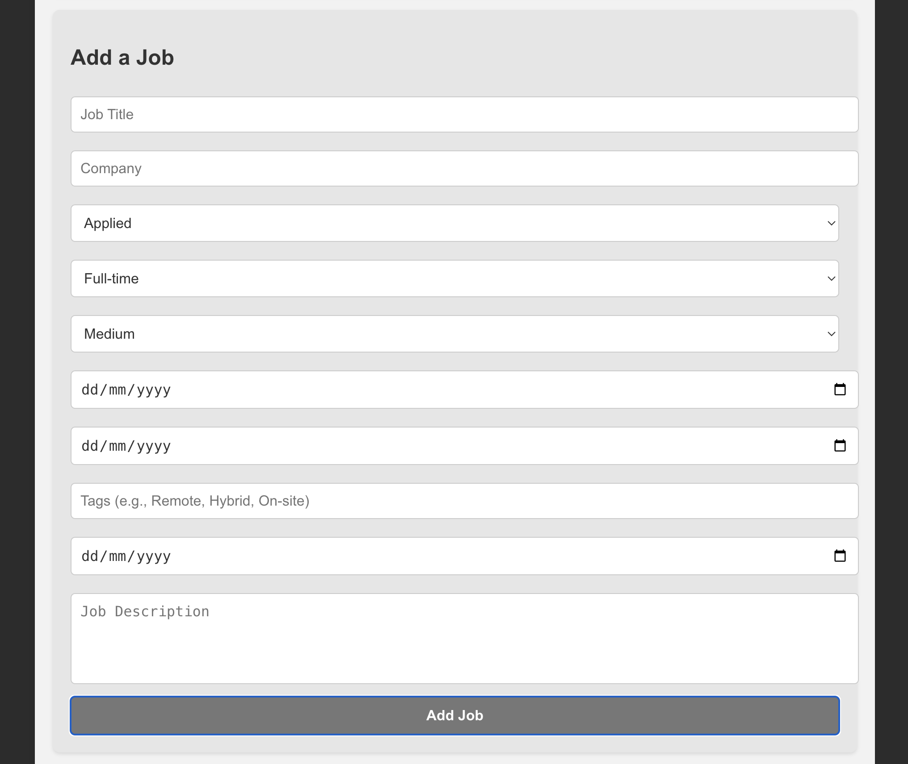
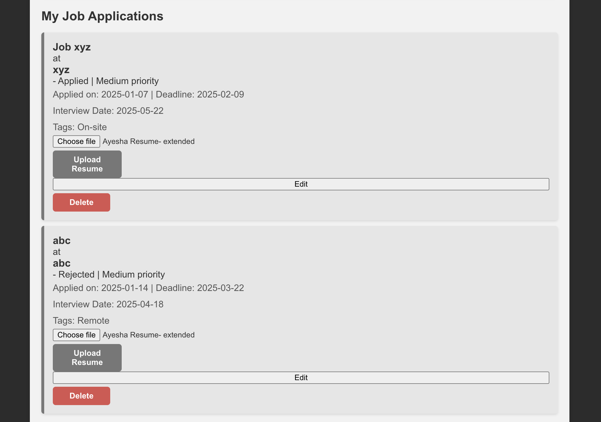
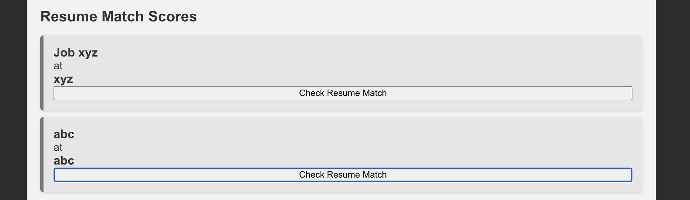
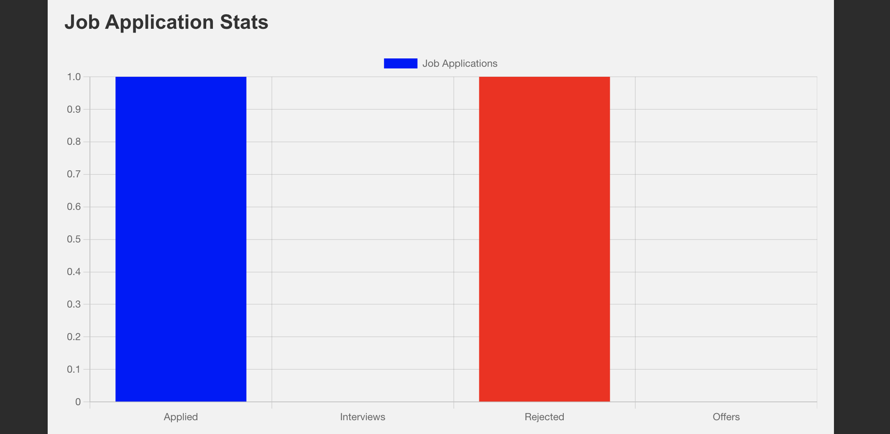

# Job Tracker Web Application

This is a full-stack job tracking web application that allows users to search for jobs, track applications, upload resumes, and check resume match scores using AI-powered keyword matching. The project integrates the **Jooble API** for job search functionality.

---

## Features

- **Job Search**: Search for jobs based on title and location using the **Jooble API**.  
- **Job Tracking**: Add, edit, and delete job applications with relevant details.  
- **Resume Upload**: Upload a resume for each job application.  
- **Resume Match Score**: AI-powered keyword matching to compare your resume with job descriptions.  
- **Job Application Dashboard**: Get insights into application progress with a bar chart visualization.  

---

## Technology Stack

### Frontend
- React.js
- Chart.js (for data visualization)

### Backend
- Flask
- SQLAlchemy (for database management)
- Spacy (for natural language processing in resume matching)

### Database
- SQLite

### External API
- Jooble API (for job search)

---

## Installation and Setup

### Clone the Repository  
```bash
git clone https://github.com/AyeshaRahman2002/Job-Tracker-WebApplication.git
cd Job-Tracker-WebApplication
```

### Backend Setup  
```bash
cd backend
python3 -m venv venv
source venv/bin/activate  # On Windows use: venv\Scripts\activate
pip install -r requirements.txt
python app.py
```
The Flask backend should now be running on `http://127.0.0.1:5000/`

### Frontend Setup  
```bash
cd frontend
npm install
npm start
```
The React frontend should now be running on `http://localhost:3000/`

---

## How to Use

1. Search for jobs using keywords and location.  
2. Add a job to your tracker with details like priority, status, and deadlines.  
3. Upload your resume to the job entry.  
4. Check Resume Match to see how well your resume aligns with the job description.  
5. Monitor your application progress through job statistics.  

---
## Screenshots

### Job Search Interface  
  

### Add a New Job  
  

### Job Applications List  
  

### Resume Upload and Matching  
  

### Job Application Statistics  
  

---

## Future Improvements

- **OAuth Integration**: Allow users to save jobs under their accounts.  
- **Auto-fetch Job Descriptions**: Extract job descriptions directly from job postings.  
- **AI-powered Resume Enhancements**: Suggest resume improvements for a better match score.  
